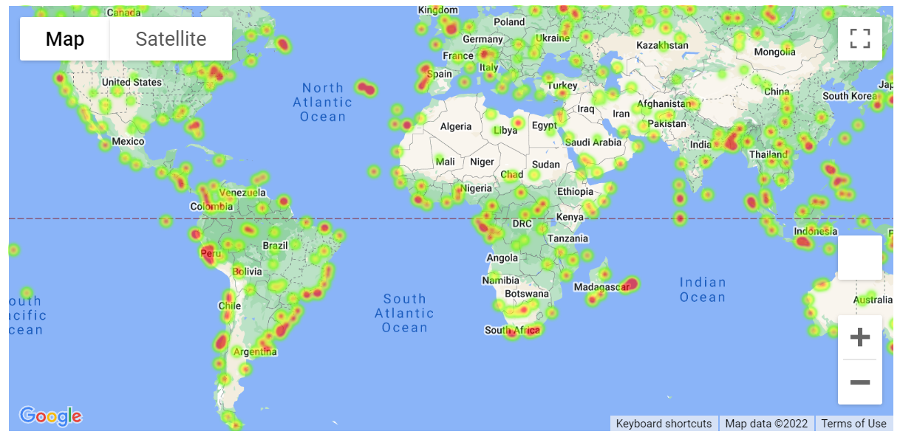

# python-api-challenge

## Background

The goal of this assignment is to utilize Python requests, APIs, and JSON traversals to answer a fundamental question: "What's the weather like as we approach the equator?"

### Initial Tasks performed

1. Created a new repository for this project called `python-api-challenge`. 

2. Cloned the new repository to my computer.

3. Inside the local Git repository, created a directory for both of the Python challenges. Used a folder name that corresponds to the challenges, such as **WeatherPy**.

4. Added new files called `WeatherPy.ipynb` and `VacationPy.ipynb`. These will be the main scripts to run for each analysis.

5. Pushed the above changes to GitHub.

### Adding a .gitignore File

Added `api_keys.py` file containing the API key to the `.gitignore` file and committed the modifications to `.gitignore`

## Part 1: WeatherPy

The goal is to create a Python script to visualize the weather of 500+ cities of varying distance from the equator. Used[simple Python library](https://pypi.python.org/pypi/citipy), the [OpenWeatherMap API](https://openweathermap.org/api),  to create a representative model of weather across cities.

The first requirement is to create a series of scatter plots to showcase the following relationships:

* Temperature (F) vs. Latitude

* Humidity (%) vs. Latitude

* Cloudiness (%) vs. Latitude

* Wind Speed (mph) vs. Latitude

After each plot, added a sentence or two explaining what the code is analyzing.

The second requirement is to compute the linear regression for each relationship. This time, separated the plots into Northern Hemisphere (greater than or equal to 0 degrees latitude) and Southern Hemisphere (less than 0 degrees latitude):

* Northern Hemisphere - Temperature (F) vs. Latitude
  - [Northern Hemisphere - Regression Plot](WeatherPy/output_data/North_LatVsMaxTemp_regression_plot.png)
* Southern Hemisphere - Temperature (F) vs. Latitude
  - [Southern Hemisphere - Regression Plot](WeatherPy/output_data/South_LatVsMaxTemp_regression_plot.png)
* Northern Hemisphere - Humidity (%) vs. Latitude
  - [Northern Hemisphere - Regression Plot](WeatherPy/output_data/North_LatVsHumidity_regression_plot.png)
* Southern Hemisphere - Humidity (%) vs. Latitude
  - [Southern Hemisphere - Regression Plot](WeatherPy/output_data/South_LatVsHumidity_regression_plot.png)
* Northern Hemisphere - Cloudiness (%) vs. Latitude
  - [Northern Hemisphere - Regression Plot](WeatherPy/output_data/North_LatVsCloudiness_regression_plot.png)
* Southern Hemisphere - Cloudiness (%) vs. Latitude
  - [Southern Hemisphere - Regression Plot](WeatherPy/output_data/South_LatVsCloudiness_regression_plot.png)
* Northern Hemisphere - Wind Speed (mph) vs. Latitude
  - [Northern Hemisphere - Regression Plot](WeatherPy/output_data/North_LatVsWindSpeed_regression_plot.png)
* Southern Hemisphere - Wind Speed (mph) vs. Latitude
  - [Southern Hemisphere - Regression Plot](WeatherPy/output_data/South_LatVsWindSpeed_regression_plot.png)

After each pair of plots, explained what the linear regression is modeling.

Defined a 'function' that created these charts based on different parameters. 

### Part 2: VacationPy

The goal is to use weather data to plan future vacations. Used Jupyter-gmaps and the Google Places API for this part of the assignment.

To complete this part of the assignment, performed the following tasks:

* Created a heat map that displayed the humidity for every city from Part 1. Here is the output:

  

* Narrowed down the DataFrame to find the ideal weather condition listed below:

  * A max temperature lower than 80 degrees but higher than 70.
  * Wind speed less than 10 mph.
  * Zero cloudiness.

* Used Google Places API to find the first hotel for each city located within 5,000 meters of my coordinates.

* Plotted the hotels on top of the humidity heatmap, with each pin containing the **Hotel Name**, **City**, and **Country**, as in the following image:

  

* For max intensity in the heatmap, tried setting it to the highest humidity found in the dataset.
